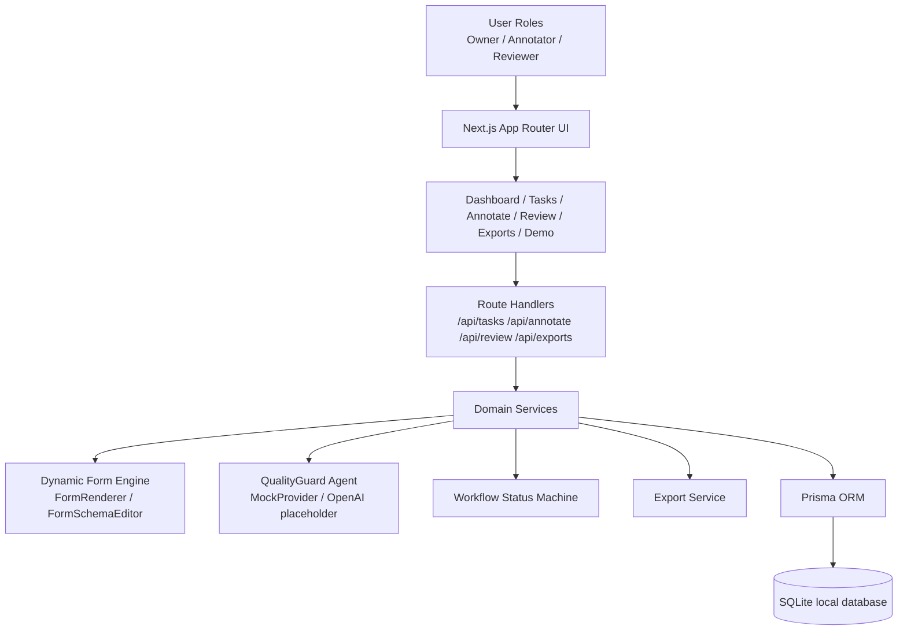
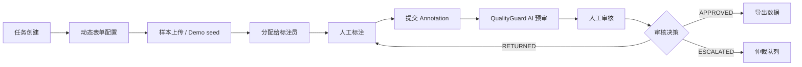
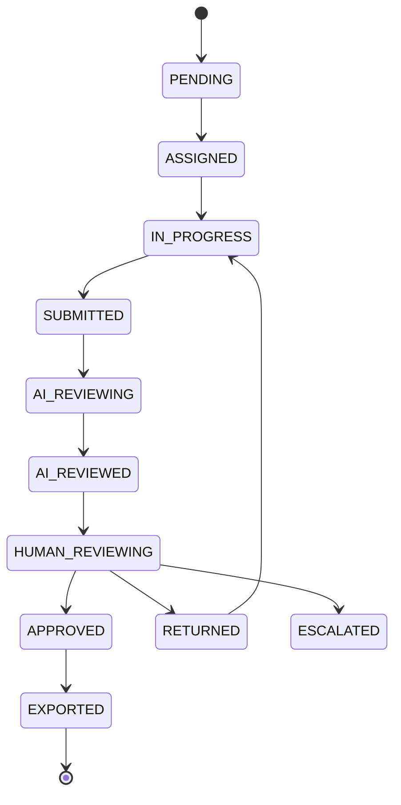

# LabelHub

## 1. 项目名称：LabelHub

LabelHub 是一个面向大模型训练数据生产与 Agent 评测的数据标注平台。

## 2. 一句话介绍

LabelHub helps teams produce high-quality training data with dynamic labeling workflow, AI quality review, and human-in-the-loop approval.

## 3. 背景与痛点

大模型应用进入业务场景后，训练数据、评测数据和复盘数据的质量直接影响模型迭代效率。传统标注后台通常存在几个问题：

- 标注字段固定，难以适配客服 QA、RAG 评测、Agent trace 等不同任务。
- 标注、AI 质检、人工审核和导出分散在不同工具中，状态难追踪。
- AI 预审容易停留在简单打分，缺少结构化证据和人工可复核依据。
- 训练数据导出缺少统一结构，难以直接接入 fine-tuning、评测和数据复盘流程。

LabelHub 的目标是提供一条轻量但完整的数据生产链路，让任务负责人能够配置任务和表单，让标注员完成动态标注，让 QualityGuard Agent 做结构化预审，再由审核员进行最终确认并导出可用数据。

## 4. 核心功能

已实现：

- 任务管理：任务列表、创建任务、任务详情和动态表单配置。
- 动态表单引擎：基于 `Task.formSchema` 渲染标注表单，支持 `radio`、`checkbox`、`select`、`rating`、`textarea`、`text`、`boolean`。
- 标注员工作台：三栏布局，展示样本队列、通用 JSON 样本数据和动态标注表单，支持草稿和提交。
- QualityGuard Agent：Rubric-based mock AI 预审，输出结构化 JSON 和 `rubricEvidence`。
- 人工审核工作台：展示 AI 风险、问题、建议、证据和人工审核表单，支持通过、退回、仲裁。
- 工作流状态机：集中管理 `SampleStatus` 的合法流转。
- 数据导出：支持 JSON、CSV、JSONL、OpenAI fine-tuning style JSONL，默认只导出 `APPROVED` 样本。
- Demo Mode：一键生成客服 QA、RAG 事实性、Agent 工具调用轨迹三类演示任务和样本。
- 测试：覆盖状态机、表单校验、QualityGuard Agent 和导出服务的关键单元测试。

计划中：

- 真实权限系统和团队成员管理。
- 文件上传、批量导入和样本分配策略。
- 真实 LLM provider 接入和调用日志。
- 更完整的数据集版本管理、导出存储和审计日志。
- PostgreSQL 生产环境部署配置和后台任务队列。

## 5. 系统架构

当前实现采用 Next.js App Router 作为全栈入口，Prisma + SQLite 作为本地数据层，页面与 API 共享业务类型和服务模块。



## 6. 核心链路



当前 Demo 中“样本上传”通过 Prisma seed 和 Demo Mode 生成数据；真实文件上传属于后续扩展。

## 7. 动态表单引擎设计

动态表单是 LabelHub 的核心抽象。任务负责人在任务详情中配置 `Task.formSchema`，标注员端不写死业务字段，而是由 schema 决定渲染内容。

已实现设计：

- 类型定义集中在 `types/formSchema.ts`。
- 表单渲染组件为 `components/form-builder/FormRenderer.tsx`。
- 表单配置组件为 `components/form-builder/FormSchemaEditor.tsx`。
- 支持字段配置：`id`、`label`、`type`、`required`、`options`、`min`、`max`、`helpText`、`defaultValue`、`validation`。
- 支持字段拖拽排序、复制、删除、required 开关、实时预览和 JSON 查看模式。
- 提交标注时基于 schema 做 required、选项、评分范围、文本长度和 pattern 校验。
- 样本展示使用通用 JSON viewer，不依赖 `user_query`、`model_answer` 等固定字段。
- 轻量 schema 版本管理：每次更新 `Task.formSchema` 会创建 `FormSchemaVersion`，并将 Annotation 绑定到提交时使用的版本，避免历史标注被新 schema 语义污染。

为什么需要 schema versioning：

- 防止任务负责人修改表单后，历史标注失去解释语义。
- 审核与复盘时可明确“该条标注基于哪个 schema 版本提交”。
- 导出与训练数据回溯时可按版本对齐，提升数据可信度。

示例 schema：

```json
{
  "fields": [
    {
      "id": "accuracy",
      "label": "准确性评分",
      "type": "rating",
      "required": true,
      "min": 1,
      "max": 5
    },
    {
      "id": "review_note",
      "label": "审核说明",
      "type": "textarea",
      "required": true,
      "validation": {
        "minLength": 12
      }
    }
  ]
}
```

## 8. QualityGuard Agent 设计

QualityGuard Agent 是当前项目中的 AI 预审模块。它不是直接调用真实模型，而是实现了可替换 provider 接口，并提供可解释的本地 mock provider，保证 Demo 不依赖外部 API。

已实现 pipeline：

1. `buildReviewContext()`：解析任务说明、rubric、formSchema、sample rawData 和 annotationData。
2. `buildRubricPrompt()`：通过 `lib/agents/prompts/qualityReviewPrompt.ts` 模板化构建 prompt。
3. `runLLMReview()`：通过 provider 执行预审。
4. `parseStructuredOutput()`：解析 provider 输出。
5. `validateAiReviewResult()`：校验结构化 JSON。
6. `fallbackToRuleBasedReview()`：当 provider 不可用或输出异常时执行本地规则预审。

Prompt 模板设计要点：

- 输入包含 `taskTitle`、`instruction`、`reviewRubric`、`formSchema`、`sampleRawData`、`annotationData`，不绑定任何业务字段。
- 明确要求模型“仅基于给定数据判断”“不确定时使用 `HUMAN_REVIEW`”“不得编造样本中不存在的信息”。
- 强制模型输出严格 JSON（无 markdown、无额外文本）。
- 提供 `getQualityReviewPromptPreview()` 调试方法，仅 `development` 环境可用。

结构化输出：

```json
{
  "score": 0.86,
  "riskLevel": "MEDIUM",
  "issues": ["文本理由过短"],
  "suggestion": "HUMAN_REVIEW",
  "comment": "QualityGuard Agent 基于 rubric 发现风险，建议人工复核。",
  "confidence": 0.74,
  "rubricEvidence": [
    {
      "criterion": "Required field completeness",
      "result": "WARN",
      "reason": "必填字段已填写，但说明内容不足。"
    }
  ]
}
```

MockProvider 的规则不绑定金融或客服字段，而是基于通用信号：

- annotationData 为空。
- required 字段缺失。
- annotationData 与 formSchema 类型不匹配。
- rating 字段低分。
- textarea 字段说明过短。
- 样本或标注中命中通用风险关键词。

OpenAI provider 当前为占位实现；真实调用必须通过环境变量 `OPENAI_API_KEY`，并通过 `AI_PROVIDER=openai` 切换。

## 9. 工作流状态机设计

Sample 的状态流转集中在 `lib/workflow/statusMachine.ts`，API 不直接随意写状态，避免页面和服务中散落硬编码。



核心函数：

- `canTransition(from, to)`
- `assertTransition(from, to)`
- `getNextAvailableActions(status)`
- `transitionSampleStatus(sampleId, nextStatus)`

状态机已有单元测试覆盖合法迁移、非法迁移和可用动作。

## 10. 数据库模型

Prisma schema 已实现以下核心模型：

- `User`：用户与角色，支持 owner、annotator、reviewer、admin。
- `Project`：项目空间，聚合多个任务。
- `Task`：任务配置，包含 `instruction`、`formSchema`、`reviewRubric`、`status`。
- `Sample`：样本数据，包含通用 JSON 字符串 `rawData`、状态和分配人。
- `Annotation`：人工标注结果，包含 `annotationData`、状态和提交时间。
- `AiReview`：AI 预审结果，包含分数、风险等级、问题、建议、评论、置信度和 rubric evidence。
- `HumanReview`：人工审核记录，包含决策、评论和审核员。
- `ExportJob`：导出记录，包含格式、状态、筛选条件、行数和文件信息。

当前本地开发使用 SQLite；schema 设计保留 PostgreSQL 生产环境迁移空间，但生产部署配置尚未完成。

## 11. 导出格式

导出服务位于 `lib/export/exportService.ts`。默认只导出 `APPROVED` 样本，并生成 `ExportJob` 记录。

支持格式：

- `JSON`：输出 `{ exportedAt, records }`，适合复盘和调试。
- `CSV`：将 `rawData`、`annotationData`、`aiReview`、`humanReview` 等结构序列化为 CSV 单元格，适合表格分析。
- `JSONL`：每行一个 LabelHub 标准记录，适合训练和评测流水线。
- `OPENAI_JSONL`：每行包含 `messages` 和 `metadata`，用于 OpenAI fine-tuning 风格数据准备。

标准记录字段：

- `sampleId`
- `rawData`
- `annotationData`
- `aiReview`
- `humanReview`
- `taskId`
- `taskName`
- `taskMetadata`
- `exportedAt`

OpenAI JSONL 示例：

```json
{
  "messages": [
    { "role": "user", "content": "{...sample.rawData}" },
    { "role": "assistant", "content": "{...annotation.annotationData}" }
  ],
  "metadata": {
    "sampleId": "sample_x",
    "taskId": "task_x",
    "taskName": "RAG 回答事实性评估",
    "qualityScore": 5,
    "riskLevel": "LOW",
    "reviewStatus": "APPROVED",
    "exportedAt": "2026-05-21T00:00:00.000Z"
  }
}
```

## 12. 本地运行方式

环境要求：

- Node.js
- pnpm
- SQLite 本地文件数据库

安装与启动：

```bash
pnpm install
cp .env.example .env
pnpm run prisma:generate
pnpm run prisma:migrate
pnpm run prisma:seed
pnpm run dev
```

打开：

- 默认地址：[http://localhost:3000](http://localhost:3000)
- 如果端口冲突：

```bash
pnpm exec next dev -H 127.0.0.1 -p 3010
```

然后访问 [http://127.0.0.1:3010](http://127.0.0.1:3010)。

常用验证命令：

```bash
pnpm run lint
pnpm run typecheck
pnpm run test
```

## 13. Demo 演示流程

进入 `/demo` 使用 Demo Mode。

推荐比赛答辩路径：

1. 点击 `Reset demo data`，生成 3 个任务模板和 30 条样本。
2. 点击 `Load demo task`，进入任务详情页，展示任务说明、reviewRubric 和 formSchema。
3. 在任务详情的 `Form schema` 页签演示字段配置、拖拽排序、复制、预览和 JSON schema。
4. 进入 `/annotate`，展示三栏标注工作台，选择样本并填写动态表单。
5. 提交 annotation 后触发 QualityGuard Agent；本地使用 mock provider，不调用真实 API。
6. 进入 `/review`，展示 AI 风险等级、issues、suggestion、rubricEvidence 和人工审核表单。
7. 执行 `APPROVED`、`RETURNED` 或 `ESCALATED` 决策。
8. 进入 `/exports`，选择任务和 `JSONL` 或 `OPENAI_JSONL`，预览前 3 条并下载文件。
9. 回到 `/dashboard`，展示样本状态分布、AI 风险分布、任务进度、标注员工作量和最近审核记录。

Demo seed 包含：

- 客服问答质量评估
- RAG 回答事实性评估
- Agent 工具调用轨迹评估

每个任务包含 instruction、reviewRubric、formSchema、10 条样本，以及部分 annotation、AI review 和 human review。

## 14. 项目亮点

已实现亮点：

- 通用样本展示：样本 `rawData` 可为任意 JSON 对象，不绑定特定业务字段。
- Schema-driven 标注：标注页面完全由 `Task.formSchema` 驱动。
- Rubric-based AI 预审：QualityGuard Agent 输出结构化结果和可复核证据。
- 状态机驱动链路：主流程状态迁移集中管理，降低 API 状态不一致风险。
- Human-in-the-loop：AI 预审只做辅助判断，最终结果由人工审核确认。
- 多格式导出：兼顾复盘、表格分析、训练管线和 OpenAI fine-tuning 数据准备。
- Demo 完整性：本地 mock provider 和 seed 数据可完整跑通主链路。
- 关键测试覆盖：已覆盖状态机、表单校验、Agent 输出和导出服务。

## 15. 未来扩展方向

计划中功能：

- 用户认证、组织空间、角色权限和任务级访问控制。
- 样本文件上传、批量导入、抽样质检和分配策略。
- 真实 OpenAI 或其他 LLM provider 接入、重试机制、调用成本统计和审计日志。
- 更细粒度的 Annotation 版本管理和标注冲突处理。
- 数据集版本、导出文件存储、可追溯 lineage 和回滚机制。
- Webhook、后台队列和异步导出任务。
- PostgreSQL 生产环境配置、部署脚本和监控指标。
- 更完整的 E2E 测试与视觉回归测试。
