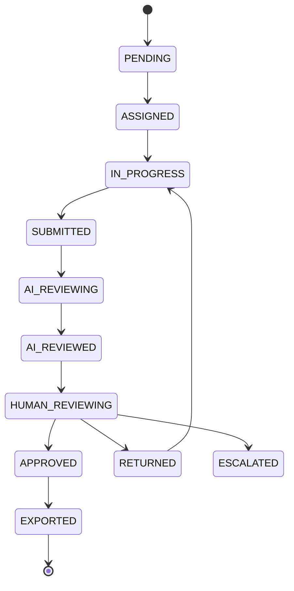
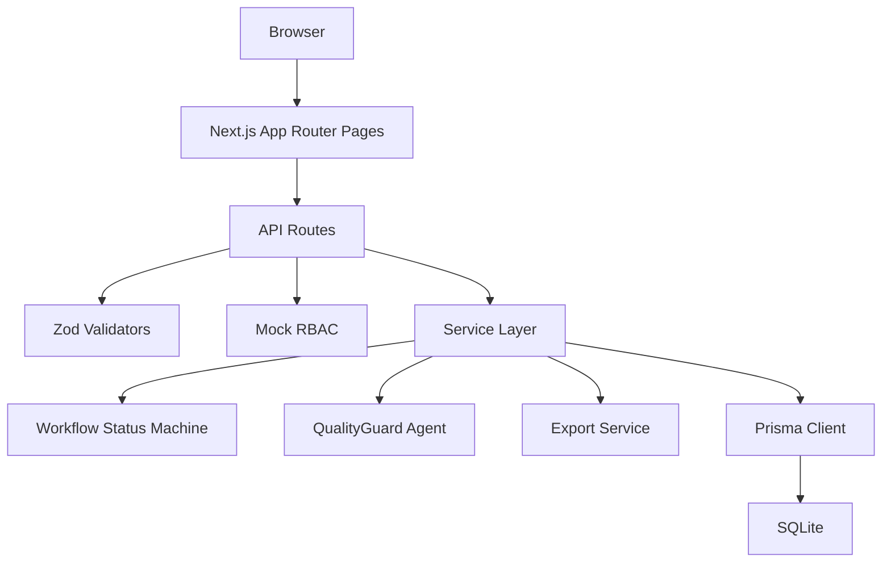
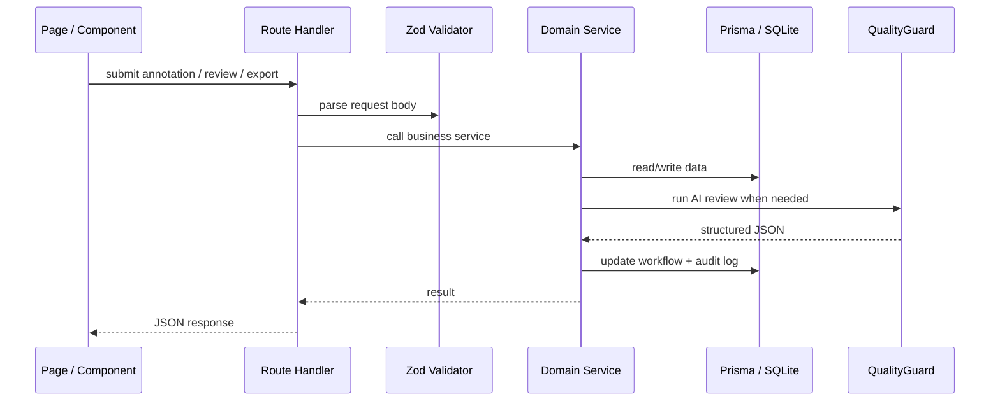

# LabelHub

LabelHub 是一个面向大模型训练数据生产与 Agent 评测的数据标注平台 Demo。它把任务配置、动态表单标注、QualityGuard AI 预审、人工审核、审计追踪和多格式导出串成一条可演示的 human-in-the-loop 数据生产链路。

> LabelHub helps teams produce high-quality training data with dynamic labeling workflow, AI quality review, and human-in-the-loop approval.

## 项目简介

大模型训练、评测和 Agent 复盘都依赖高质量数据。普通标注后台往往只能录入固定字段，难以适配客服 QA、RAG 事实性评估、Agent trace 等不同任务，也缺少 AI 预审、人工审核、状态追踪和训练格式导出。

LabelHub 的目标不是把 Demo 包装成完整商业系统，而是展示一个“数据生产平台”的核心工程骨架：

- 任务负责人配置任务、rubric 和动态表单。
- 标注员基于任意 JSON 样本提交结构化标注。
- QualityGuard Agent 基于 rubric 做结构化预审。
- 审核员结合 AI 证据完成最终决策。
- 任务负责人导出可用于训练、评测和复盘的数据。

## 技术栈

- Next.js App Router
- TypeScript
- Tailwind CSS
- shadcn/ui 风格组件
- Prisma
- SQLite local database
- Zod
- Vitest

## 核心功能

### 动态表单引擎

标注表单完全由 `Task.formSchema` 驱动，不在标注页面硬编码业务字段。当前支持：

- `radio`
- `checkbox`
- `select`
- `rating`
- `textarea`
- `text`
- `boolean`

任务负责人可以在任务详情中编辑字段、排序、复制、设置 required、helpText、defaultValue、validation，并通过实时预览和 JSON 查看模式展示技术亮点。

### 通用 rawData 展示

样本原始数据通过 `SampleDataViewer` 渲染，支持任意 JSON object、array、string、number、boolean 和 nested object。页面不绑定 `user_query`、`model_answer`、`reference_answer` 等具体业务字段，因此同一套页面可以展示客服 QA、RAG 评测、图片分类元数据或 Agent trace 数据。

### QualityGuard Agent

QualityGuard Agent 输入包括：

- task instruction
- reviewRubric
- formSchema
- sample rawData
- annotationData

Agent 输出结构化 JSON，包含 `score`、`riskLevel`、`issues`、`suggestion`、`comment`、`confidence` 和 `rubricEvidence`。当前本地 Demo 默认使用 `MockProvider`，规则基于 required 缺失、类型不匹配、低评分、短文本说明和通用风险关键词，不依赖真实 API。

`OpenAIProvider` 目前是占位实现，真实 API Key 必须来自环境变量 `OPENAI_API_KEY`。

### Human-in-the-loop 审核流

审核员在 `/review` 查看已完成 AI 预审的样本，结合原始样本、标注结果、AI 风险等级、问题列表、建议和 rubric evidence 做最终决策：

- `APPROVED`：通过，可进入导出。
- `RETURNED`：退回重标。
- `ESCALATED`：提交仲裁。

### 工作流状态机

Sample 状态流转集中在 `lib/workflow/statusMachine.ts`，标注提交、AI 预审、人工审核和导出都通过状态机更新，避免 API 或页面散落状态硬编码。



### AuditLog 审计日志

项目新增 `AuditLog` 模型和 `auditLogService`，记录任务创建、formSchema 更新、样本分配、标注提交、AI 预审、人工审核和导出等关键动作。日志只记录轻量 metadata，不复制完整 rawData，用于质量追踪和演示企业级可观测性思路。

### 多格式导出

导出默认只包含 `APPROVED` 样本，并生成 `ExportJob` 记录。当前支持：

- JSON
- CSV
- JSONL
- OpenAI fine-tuning style JSONL

导出内容可选择是否包含 AI 预审、人工审核和 task metadata。

## 系统架构



核心请求路径：



## 模块划分

- `app/`：Next.js 页面和 API route。
- `components/layout/`：侧边栏、顶部导航、页面标题等布局组件。
- `components/form-builder/`：动态表单渲染器和 schema 编辑器。
- `components/sample/`：通用 JSON 样本展示组件。
- `components/annotate/`：标注工作台组件。
- `components/review/`：审核工作台、风险 Badge、AI Review 展示组件。
- `components/common/`：Empty、Error、Loading 等通用状态组件。
- `lib/services/`：任务、样本、标注、审核、导出和审计日志业务逻辑。
- `lib/agents/`：QualityGuard Agent、provider 抽象和 prompt 模板。
- `lib/workflow/`：Sample 状态机。
- `lib/validators/`：Zod API 请求校验。
- `lib/auth/`：mock 当前用户与轻量 RBAC。
- `lib/templates/`：内置任务模板。
- `types/`：formSchema、sample、API 等共享类型。
- `prisma/`：数据库 schema、migration 和 seed。
- `submission/`：比赛提交材料。

## 本地启动方式

### 1. 安装依赖

```bash
npm install
```

如使用 pnpm：

```bash
pnpm install
```

### 2. 配置环境变量

在项目根目录创建 `.env`：

```bash
DATABASE_URL="file:./dev.db"
AI_PROVIDER="mock"
```

本地 Demo 不需要真实模型 API。后续如接入真实 provider，API Key 必须通过环境变量提供：

```bash
OPENAI_API_KEY="..."
```

### 3. 初始化数据库

```bash
npm run prisma:generate
npm run prisma:migrate
npm run prisma:seed
```

### 4. 启动开发服务器

```bash
npm run dev
```

默认访问：

- [http://localhost:3000](http://localhost:3000)

如果 3000 端口被占用：

```bash
npm run dev -- -p 3001
```

然后访问：

- [http://localhost:3001](http://localhost:3001)

### 5. 验证命令

```bash
npm run lint
npm run typecheck
npm run test
```

## Demo 演示流程

以下流程覆盖任务负责人、标注员、审核员三类角色的完整数据生产链路：

1. `/dashboard`：查看数据生产质量看板。
2. `/demo`：Reset demo data，生成三类演示任务。
3. `/tasks/new`：选择任务模板，展示 instruction、reviewRubric 和 formSchema 自动填充。
4. `/tasks/[id]`：展示任务详情、动态表单编辑、schema version 和操作记录。
5. `/annotate`：以标注员视角查看样本队列、通用 rawData 和动态标注表单。
6. `/review`：以审核员视角查看 AI 预审结果、rubric evidence，并提交人工审核。
7. `/exports`：选择 JSON、CSV、JSONL 或 OpenAI JSONL，预览前 3 条并下载。

Demo seed 包含：

- 客服问答质量评估
- RAG 回答事实性评估
- Agent 工具调用轨迹评估

## Demo 视频

演示视频文件托管在 GitHub Release：

- [LabelHub Demo Video](https://github.com/yuansiyuanxjtu/labelhub-ai-platform/releases/download/v1.0.0/LabelHub-demo-video.mp4)

视频时长约 5 分钟左右，以 Release 附件实际播放时长为准。视频覆盖三大角色完整链路：任务负责人创建任务、选择模板并配置动态表单；标注员查看样本并提交动态表单标注；审核员查看 QualityGuard AI 预审结果、完成人工审核并进入数据导出流程。

如果线上环境不可用，可以按照本文档的本地启动方式运行项目，再参考 `submission/08-Demo演示脚本.md` 复现完整链路。

## API 文档入口

核心 API 说明见：

- [submission/07-API文档.md](/submission/07-API文档.md)

主要接口包括：

- `GET /api/tasks`
- `POST /api/tasks`
- `GET /api/tasks/[id]`
- `PATCH /api/tasks/[id]`
- `GET /api/annotate/samples`
- `PUT /api/annotate/samples/[id]/annotation`
- `POST /api/annotations/[id]/ai-review`
- `GET /api/review`
- `POST /api/review/[id]`
- `GET /api/exports`
- `POST /api/exports`
- `GET /api/dashboard`
- `POST /api/demo/reset`
- `GET /api/auth/me`
- `POST /api/auth/role`

核心写接口使用 Zod 校验和统一错误结构。

## submission 材料说明

比赛交付材料集中在 `submission/`：

- [00-提交说明.md](/submission/00-提交说明.md)
- [01-项目总览.md](/submission/01-项目总览.md)
- [02-架构设计.md](/submission/02-架构设计.md)
- [03-关键技术点.md](/submission/03-关键技术点.md)
- [04-AI-Coding过程记录.md](/submission/04-AI-Coding过程记录.md)
- [05-本地启动指南.md](/submission/05-本地启动指南.md)
- [06-演示环境说明.md](/submission/06-演示环境说明.md)
- [07-API文档.md](/submission/07-API文档.md)
- [08-Demo演示脚本.md](/submission/08-Demo演示脚本.md)
- [diagrams/README.md](/submission/diagrams/README.md)
- [video/demo-video-link.md](/submission/video/demo-video-link.md)

`submission/images/` 已包含 6 张 Demo 截图，覆盖 Dashboard、任务管理、任务配置、标注、审核和导出页面。

## 当前限制与未来优化

当前版本是比赛 Demo 和工程样板，不夸大为完整生产级商业系统。

已知限制：

- RBAC 是本地 mock 角色切换，没有真实登录、会话、组织和成员管理。
- `OpenAIProvider` 是占位实现，本地默认 `AI_PROVIDER=mock`。
- 样本主要通过 seed 和 Demo Mode 生成，尚未实现完整文件上传、批量导入和分配策略 UI。
- 导出文件以浏览器下载为主，未接入对象存储、异步队列和后台任务监控。
- SQLite 用于本地开发，PostgreSQL 生产部署配置尚未完成。
- 审计日志已覆盖关键动作，但还没有完整的操作检索、告警和报表能力。

未来优化方向：

- 接入真实认证系统和任务级权限。
- 支持批量上传、抽样质检、冲突标注和仲裁工作台。
- 完成真实 LLM provider、重试、限流、成本统计和调用追踪。
- 增加数据集版本、导出 lineage、对象存储和异步导出。
- 增加 E2E 测试、视觉回归测试和生产部署文档。
