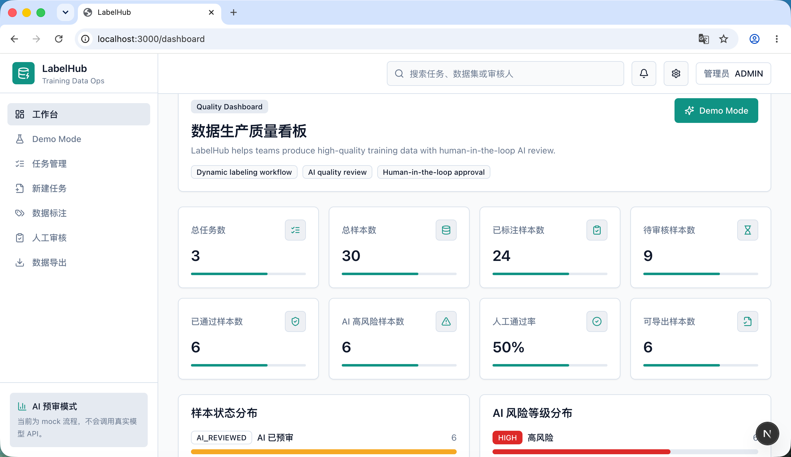
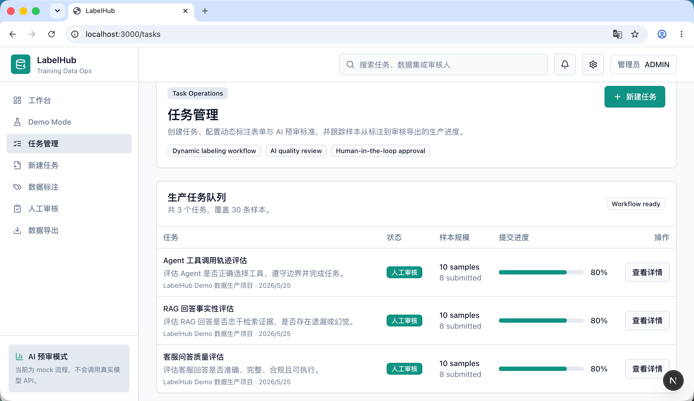
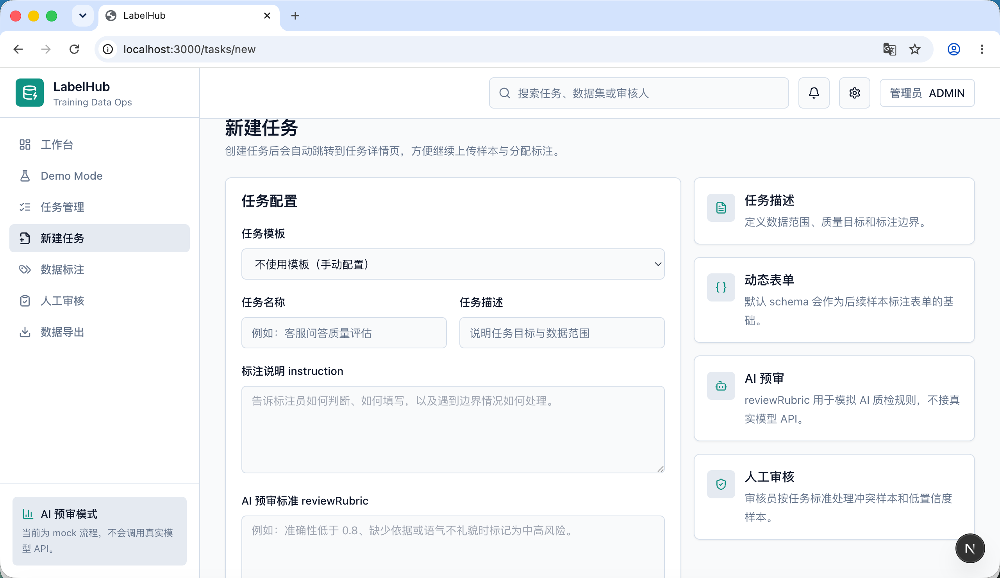
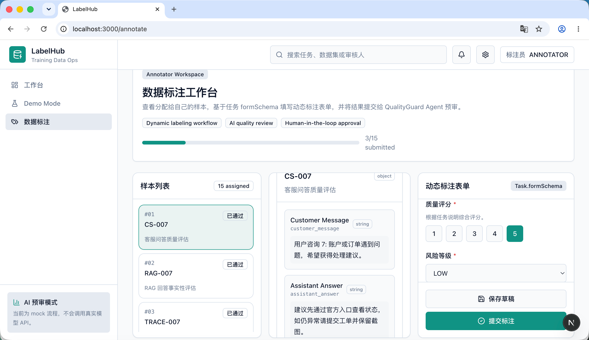
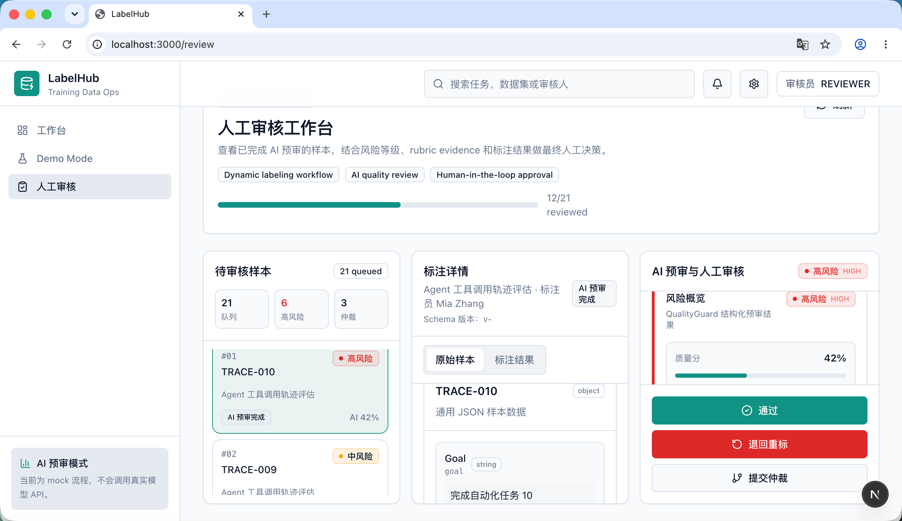
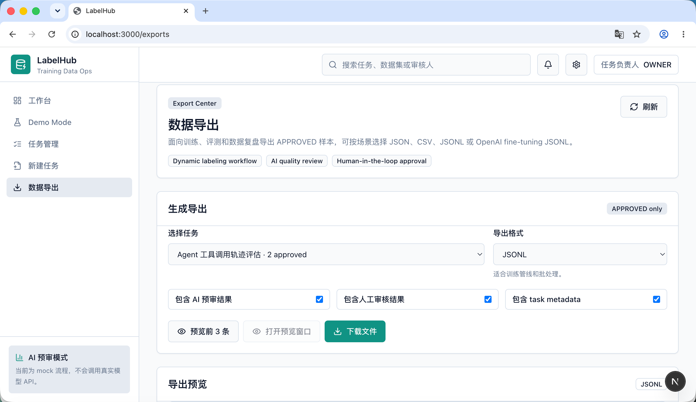

# 项目总览

## 一句话介绍

LabelHub helps teams produce high-quality training data with human-in-the-loop AI review.

## 背景与痛点

大模型训练、评测和 Agent 迭代依赖高质量数据。传统标注后台通常只解决录入问题，对动态表单、质量预审、审核流转、导出复盘和审计追踪支持不足，导致数据生产过程难以标准化、复用和证明可信。

LabelHub 的目标是把数据标注从普通 CRUD 后台升级为可配置、可审核、可导出的数据生产工作台。

## 核心链路

任务创建 -> 动态表单配置 -> 样本上传或 seed -> 人工标注 -> QualityGuard AI 预审 -> 人工审核 -> 数据导出

下图展示 Dashboard 数据生产质量看板，用于快速观察任务、样本、风险和审核进度。

任务管理页面展示了不同类型数据生产任务的队列状态，包括任务名称、样本规模、提交进度和当前审核状态，体现平台对多任务数据生产流程的统一管理能力。

## 已实现模块

- 任务管理：任务列表、创建任务、任务详情和 formSchema 编辑。
- 任务模板：内置 LLM 回答质量评估、RAG 事实性评估、Agent 工具调用轨迹评估。
- 动态表单：由 `Task.formSchema` 驱动渲染，支持 radio、checkbox、select、rating、textarea、text、boolean。
- 通用样本展示：基于任意 JSON `rawData` 渲染，不绑定客服 QA 字段。
- 标注工作台：展示分配样本，保存草稿，提交标注。
- QualityGuard Agent：基于任务说明、rubric、formSchema、rawData 和 annotationData 做结构化预审；本地默认 mock provider。
- 人工审核：展示 AI 预审结果、rubric evidence、标注结果，并提交通过、退回或仲裁。
- 工作流状态机：集中管理 Sample 状态迁移。
- 数据导出：支持 JSON、CSV、JSONL 和 OpenAI fine-tuning style JSONL，默认只导出 APPROVED 样本。
- Demo Mode：一键重置演示数据，并支持 mock 角色切换。
- 审计日志：记录任务、标注、AI 预审、人工审核和导出等关键操作。
- 测试：包含工作流、formSchema、QualityGuard Agent 和 exportService 的关键测试。

下图展示任务负责人从模板创建任务，并在 Task Builder 中配置动态标注表单。

下图展示标注员工作台中的样本列表、通用 rawData 和由 formSchema 渲染的动态标注表单。

下图展示审核员工作台中的 AI 预审结果、rubric evidence 和人工审核操作。

下图展示导出中心如何选择任务、导出格式、导出选项并预览数据。

## 当前限制

- 权限系统为本地 mock RBAC，没有真实登录和会话体系。
- `AI_PROVIDER=openai` 仍是占位实现，比赛 Demo 使用 `AI_PROVIDER=mock`。
- 样本数据主要通过 seed 生成，未实现完整文件上传和批量分配 UI。
- 本地开发使用 SQLite，生产级部署、队列和对象存储属于后续规划。
