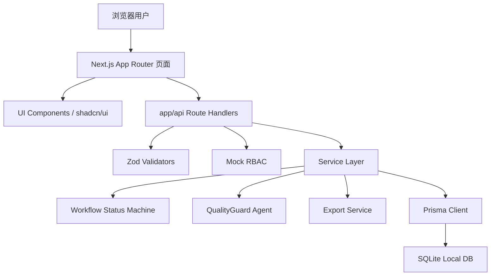
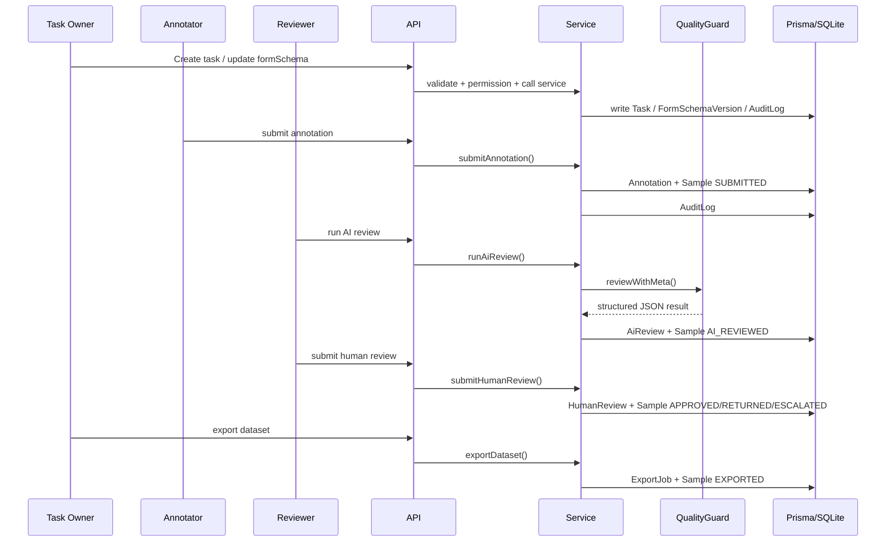
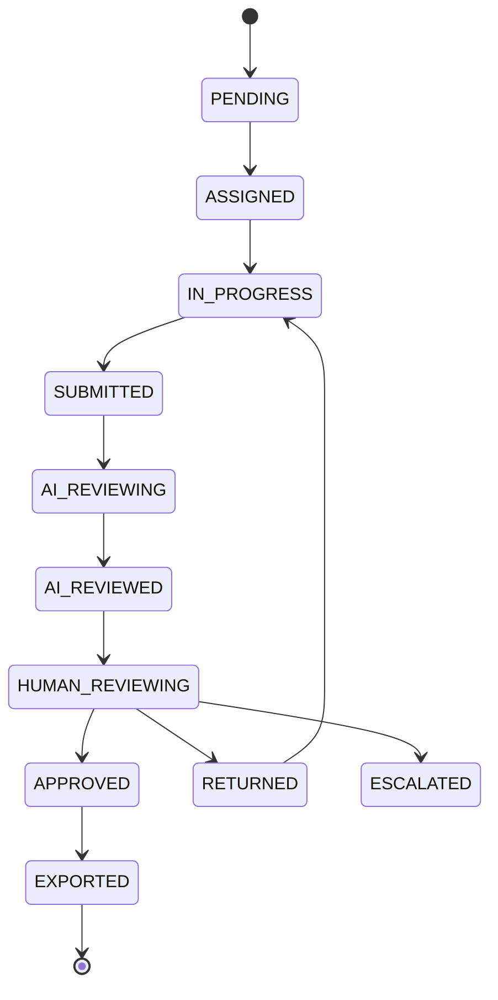

# 架构设计

## 分层架构

## 主链路时序

## 工作流状态图

## 目录职责

- `app/`：页面和 API route。
- `components/`：页面组件、通用 UI、动态表单组件、样本展示和审核组件。
- `lib/services/`：标注、审核、导出、任务和审计日志等业务服务。
- `lib/agents/`：QualityGuard Agent、provider 抽象和 prompt 模板。
- `lib/workflow/`：样本状态机和合法流转。
- `lib/validators/`：核心 API 的 Zod 请求校验。
- `lib/auth/`：本地 mock 当前用户和轻量 RBAC。
- `types/`：formSchema、sample、API 等共享类型。
- `prisma/`：数据库 schema、migration 和 seed。

