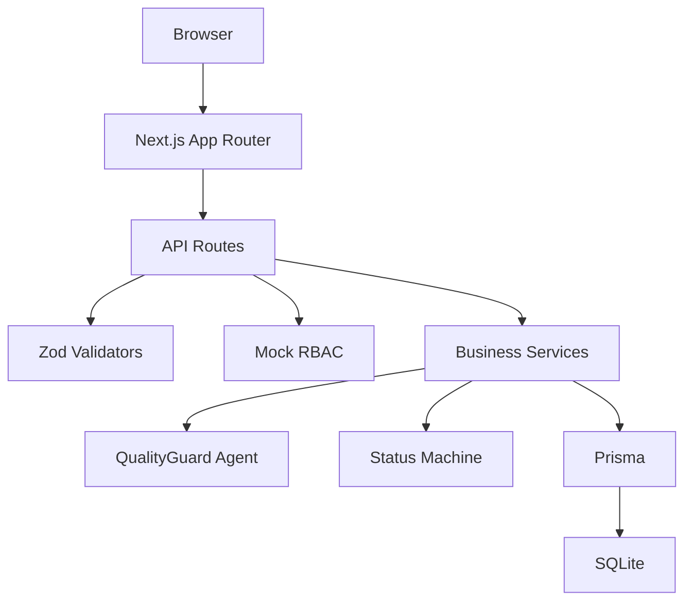
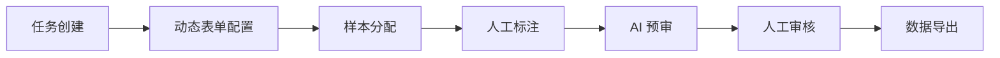

# Mermaid 图源

本目录先保存 Mermaid 图源，后续可根据比赛材料需要导出为 PNG/SVG。

## 系统架构图

```mermaid
flowchart TB
  Browser["Browser"]
  Next["Next.js App Router"]
  API["API Routes"]
  Zod["Zod Validators"]
  Auth["Mock RBAC"]
  Services["Business Services"]
  Agent["QualityGuard Agent"]
  Workflow["Status Machine"]
  Prisma["Prisma"]
  SQLite["SQLite"]

  Browser --> Next
  Next --> API
  API --> Zod
  API --> Auth
  API --> Services
  Services --> Agent
  Services --> Workflow
  Services --> Prisma
  Prisma --> SQLite
```

## 数据生产工作流

```mermaid
flowchart LR
  Task["任务创建"]
  Schema["动态表单配置"]
  Sample["样本分配"]
  Annotation["人工标注"]
  Ai["AI 预审"]
  Human["人工审核"]
  Export["数据导出"]

  Task --> Schema --> Sample --> Annotation --> Ai --> Human --> Export
```

